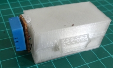
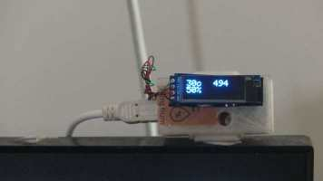
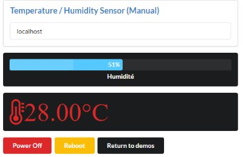
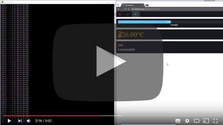
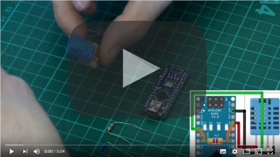

[English](https://madnerdorg.github.io/temphum/)

[](https://madnerdorg.github.io/libreconnect/doc/fr/devices)   
[Download TempHum](https://github.com/madnerdorg/temphum/archive/master.zip) /  [LibreConnect](https://madnerdorg.github.io/libreconnect/) / [Source](https://github.com/madnerdorg/temphum)

- [C'est quoi temphum](#cest-quoi-temphum)
- [Applications](#applications)
- [Fabriquer temphum](#fabriquer-temphum)
- [Commandes](#commandes)

# C'est quoi temphum
   
temphum est un capteur de température et d'humidité USB.
Vous pouvez ajouter une photorésistance pour mesurer la luminosité.

Une version avec un petit affichage sera disponible plus tard     


# Applications
## Afficher la température et l'humidité sur une page web
Voici un exemple de widget : [http://madnerd.org/interface/temphum](http://madnerd.org/interface/temphum)



## Faire son propre widget de température et d'humidité avec libreInterface
* Aller sur [libreInterface](http://madnerd.org/interface/editor.html)
* Importer **apps/libreInterface/dht11.json**
* Modifier le code

[](https://www.youtube.com/watch?v=yIe4TfZuU6A)

Toutes les modifications faites à l'aide de la console de développement seront sauvegardés.   
Aller sur [http://github.com/madnerdorg/libreinterface](libreInterface) pour plus d'informations.

# Fabriquer temphum
[](https://www.youtube.com/watch?v=eIsdwXkPbS0)
## Copie du programme Arduino
* Copier **libraries/temphum** dans le carnet de croquis Arduino
* Téléverser **temphum/temphum.ino**
* Aller sur http://madnerd.org/interface/temp_hum


Pour ajouter la photorésistance, changez cette ligne dans le code arduino    
```
const bool hasPhotoResistor = true;
```

## Composants
* Arduino nano CH340G: 2€
* DHT11 : 2€
* Resistor pack 400pcs (3€) (1 resistor: 0.0071€)
> Total : 6€ (4€) 

## Branchement
Vous devez mettre une résistance qui relie la broche 2 avec le 5v


* Arduino - 2 : DATA (2) 
* Arduino - 2 : RESISTANCE (4,7kΩ) --> VCC (1)
* Arduino - 5v : VCC (1)
* Arduino - GND : GND (4)

## Modèle 3D
Modèles fait par Olivier Sarrailh : https://github.com/madnerdorg/temphum/tree/master/stl    

# Commandes
* /info -------> affiche nom:port 
```
temphum:42004
```
Une fois /info envoyé , le périphérique va envoyé humidité(%);temp(°c) ou humidité(%);temp(°c);luminosité(/1024)
```
50.00;24.00;600
```

# Licences

## temphum.ino
* Auteur: Rémi Sarrailh (madnerd.org)       
* Licence: MIT   

## DHT_sensor_library
* Auteur : Tony DiCola (Adafruit Industries)
* Licence : MIT
* Lien : https://github.com/adafruit/DHT-sensor-library

