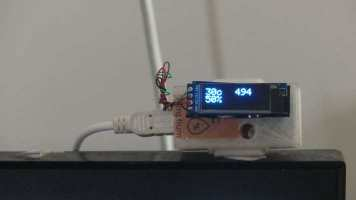
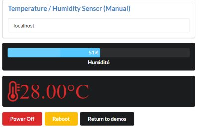
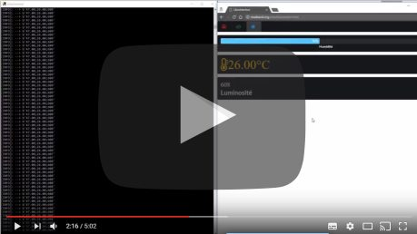
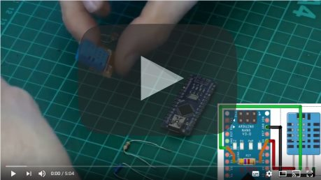

[Français](https://madnerdorg.github.io/temphum/README.fr)

[](https://madnerdorg.github.io/libreconnect/doc/en/devices)   
[Download TempHum](https://github.com/madnerdorg/temphum/archive/master.zip) /  [LibreConnect](https://madnerdorg.github.io/libreconnect/) / [Source](https://github.com/madnerdorg/temphum)

- [What is temphum ?](#what-is-temphum-)
- [Applications](#applications)
- [How to build temphum ?](#how-to-build-temphum-)
- [Commands](#commands)

# What is temphum ?
   
temphum is an USB temperature/humidity sensor.   
You can optionally add a photoresistor to measure light.    

A version with a small display will be available later.        


# Applications
## Display temperature and humidity on a web page.   
There is a example of a widget here [http://madnerd.org/interface/temphum](http://madnerd.org/interface/temphum])


## Build your own temperature sensor widget using libreInterface   
* Go to [libreInterface](http://madnerd.org/interface/editor.html)
* Import **apps/libreInterface/dht11.json**
* Modify the code

[](https://www.youtube.com/watch?v=lKUhhlHZKvI)

All modifications made using the developer console will be saved.   
Go to [http://github.com/madnerdorg/libreinterface](libreInterface) for more information.

# How to build temphum ?
[](https://www.youtube.com/watch?v=5_wHOCGhlcE)

## Upload
* Copy **arduino/libraries** into Arduino Sketchbooks folder
* Upload **arduino/temphum/temphum.ino**
* Test your sensor on [http://madnerd.org/interface/temphum](http://madnerd.org/interface/temphum)


To add the photoresistor change this line in the arduino code
```
const bool hasPhotoResistor = true;
```

## Components
* Arduino nano CH340G: 2€
* DHT11 : 2€
* Resistor pack 400pcs (3€) (1 resistor: 0.0071€)
> Total : 6€ (4€) 

## Wiring
You need to add a 4,7kΩ resistor between 5v/pin 2.


* Arduino - 2 : DATA (2) 
* Arduino - 2 : RESISTOR (4,7kΩ) --> VCC (1)
* Arduino - 5v : VCC (1)
* Arduino - GND : GND (4)

## 3D printing
Models by Olivier Sarrailh : [https://github.com/madnerdorg/temphum/tree/master/stl](https://github.com/madnerdorg/temphum/tree/master/stl)

# Commands
/info -------> Give name:port     
```
temphum:42004
```
Once /info is sent , the device will send humidity(%);temp(°c) or humidity(%);temp(°c);light(/1024)
```
50.00;24.00;600
```

# Licences

## temphum.ino
* Author: Rémi Sarrailh (madnerd.org)       
* Licence: MIT   

## DHT_sensor_library
* Author : Tony DiCola (Adafruit Industries)
* Licence : MIT
* Link : https://github.com/adafruit/DHT-sensor-library

